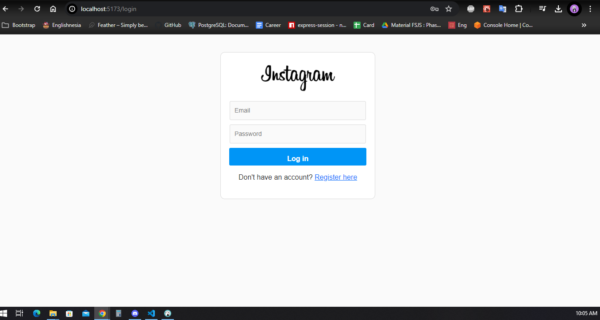
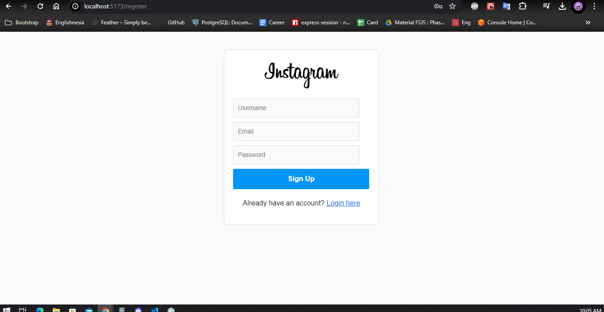
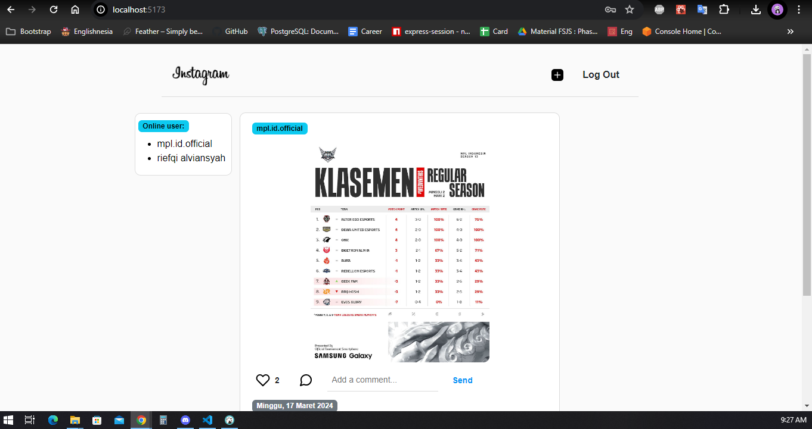
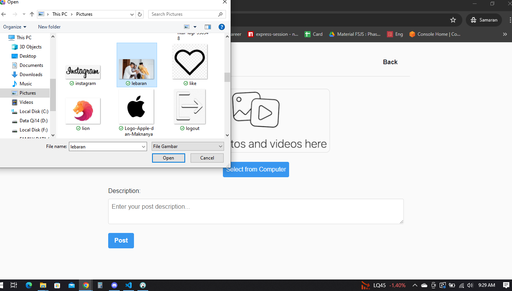
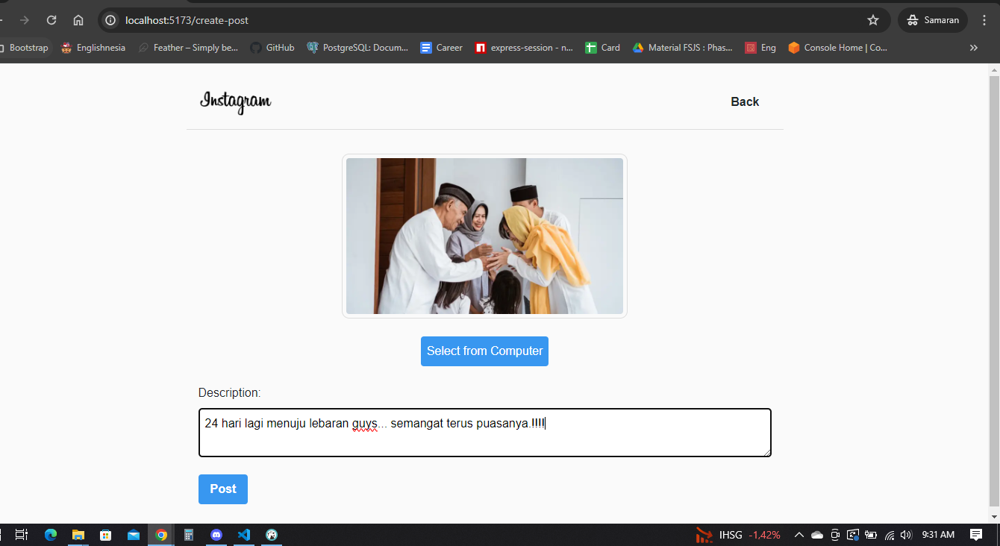

# Ig-Clone

## deskripsi

- Merupakan aplikasi social media sederhana yang bertemakan instagram ditujukan sebagai bentuk pembelajaran dalam menerapkan fitur real-time iinteraksi antara user yang login
- Aplikasi ini dirancangan dengan menggunakan:

  - ### Server
    - Express
    - Postgres
    - SocketIO
    - Sequelize
    - Cloudinary
    - Bycryptjs
    - Jsonwebtoken
    - Multer
  - ### Client
    - React
    - Redux
    - SocketIO Client
    - Sweetalert2
    - Axios
    - Vanila CSS and Bootstrap

- Fitur yang ada pada aplikasi ini adalah:
  - Register
  - Login
  - Create post (real time)
  - Like (real time)
  - Comment (real time)
  - List user login (real time)

## hal yang perlu ditingkatkan

- Tampilan responsive
- Bisa membuat antar user melakukan chating
- Penulisan kode pada bagian socket io masih kurang optimal, terdapat kode yang berulang
- Penerapan fitur unlike postingan, delete comment, delete post
- ...

## setup

- server
  `npx nodemon bin/www`

- client
  `npm run dev`

## tampilan

- register

  

- register

  

- home

  

- create post - upload image

  

- create post - posting post

  

- Home

  
